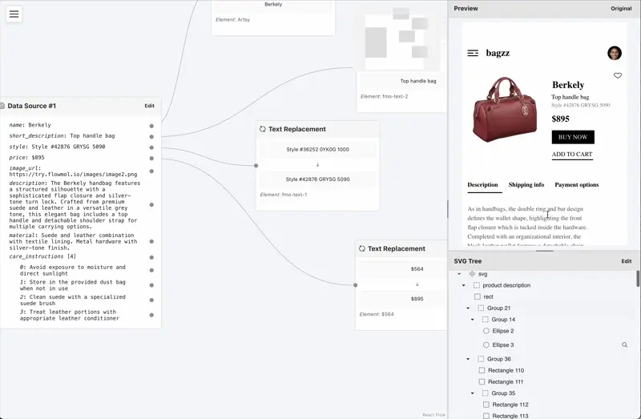

# FlowMolio

A lightweight React library for real-time mockups and prototypes.

## Description

FlowMolio bridges the gap between content management systems and Figma designs - minimizing code requirements for dynamic content integration.

### What it does

FlowMolio connects three essential components of your design-to-implementation workflow:

1. **Content Management Systems** - Where your structured data lives
2. **Figma Designs** - Where your visual mockups are created
3. **Interactive Prototypes** - Where your designs come to life

### How it works

- **Initial Setup** - A developer handles the library installation, basic configuration, and deployment
- **Content Connections** - Once set up, connecting CMS fields to design elements requires zero code
- **Ongoing Use** - Content editors and designers can make changes without developer intervention

FlowMolio creates a seamless link between your CMS API and Figma designs, allowing real-time content updates to flow directly into your visual prototypes.

### Key Features

- **Minimal-Code Integration** - After initial setup, connect your CMS to Figma without writing additional code
- **Real-Time Updates** - See content changes instantly reflected in your designs
- **API-Agnostic** - Works with virtually any headless CMS or API endpoint
- **Figma-Native** - Uses your existing Figma designs without modification
- **React-Powered** - Built on React for optimal performance and flexibility

## FlowMolio Studio

[FlowMolio Studio](https://flowmol.io) is a tool for connecting data sources to Figma mockups exported as SVGs. It allows users to visually connect JSON data values to SVG elements in a node-based editor, with real-time updates in the rendered SVG.



## FlowMolio Sample

Check out the [sample code](https://github.com/vladvlasov256/flowmolio-sample) or try the [live demo](https://try.flowmol.io/)!

This sample project demonstrates how FlowMolio connects product data to a Figma-designed interface.

### Get Started

Experience the power of connected design by installing FlowMolio today:

```yarn add flowmolio```

Displaying a preview:

```typescript
import { FlowMolioPreview } from 'flowmolio'

// API response
const product = {
  name: "Berkely",
  image_url: "https://try.flowmol.io/images/image1.png",
  ...
}

// FlowMolio blueprint
const flowmolio = {} 

<FlowMolioPreview dataSources={{"data-source-1": product}} previewObject={flowmolio} />
```
